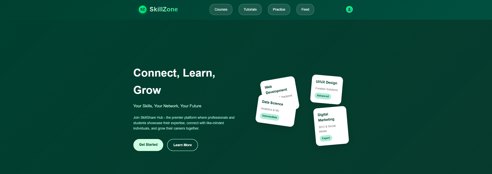
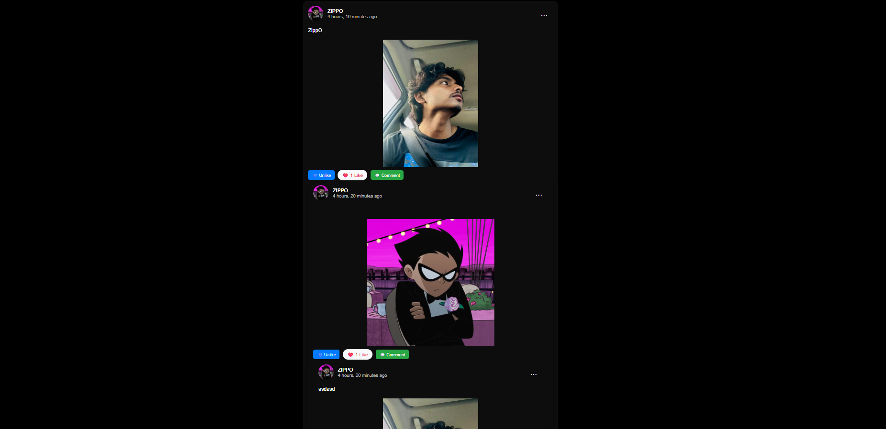
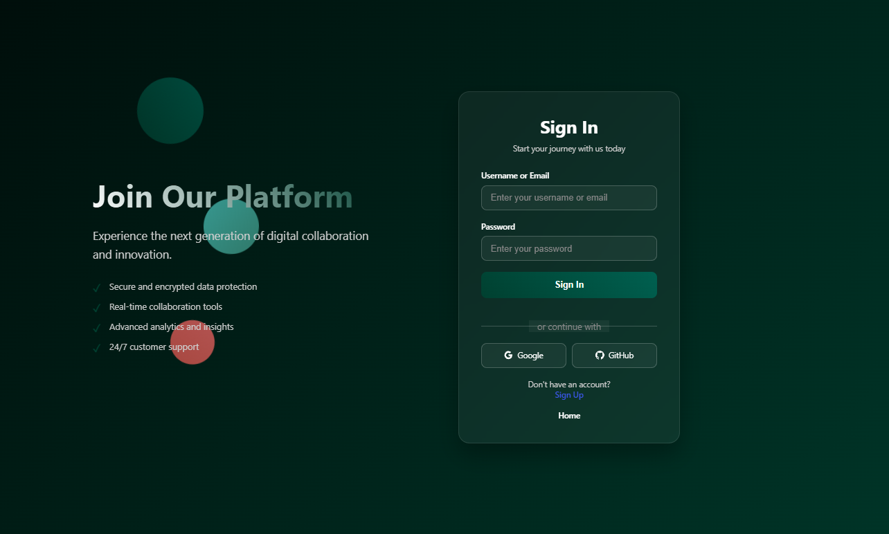
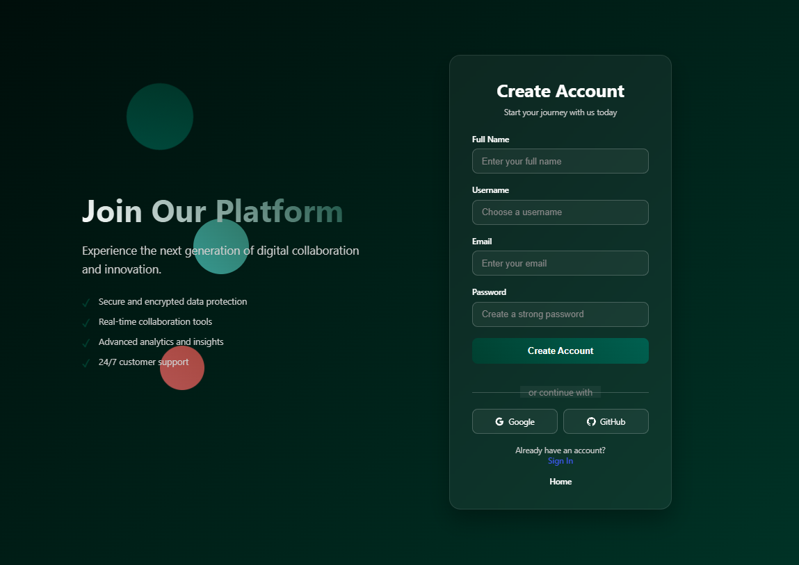
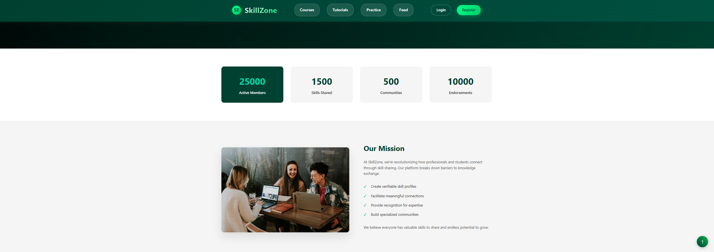

# 🚀 SkillZone – Django Project

**SkillZone** is a powerful Django-based web application built for students and professionals to **share, showcase, and grow their skills** in a community-driven environment. It blends the functionality of a personal portfolio, a certificate showcase, and a social skill-sharing network — making it perfect for both learners and collaborators.

Whether you’re a student looking to validate your learning journey or a professional aiming to present your expertise, SkillZone gives you a space to highlight your **skills**, **upload certificates**, **join interest-based groups**, and **receive endorsements** from peers.

---

## 🖼️ Project Preview

  
  
  
  
  
  


---

## 📦 Core Features

- 👤 **User Profiles**
  - One-to-One profile for each user
  - Includes bio, avatar, location, and social media links

- 🎯 **Skill Listing & Endorsement**
  - Users can list skills and get endorsed by others
  - Many-to-Many relationship between profiles and skills

- 📂 **Certificate Uploads**
  - Upload certificates (images or PDFs) and link them to specific skills

- 👥 **Groups & Communities**
  - Users can join multiple groups like "Python Developers", "UI/UX Designers", etc.
  - Many-to-Many relationship between profiles and groups

- 🌍 **Public Profile Pages**
  - SEO-friendly URLs like `/profile/username/`
  - Showcase user’s skills, certificates, group memberships, and endorsements

- 🧾 **Feed & Posts**
  - Share thoughts, achievements, or news with the community
  - Like and comment functionalities (optional for social interaction)

- 🔐 **Authentication System**
  - Custom user model
  - Secure login, registration, and logout functionality

- 📁 **Media Upload Support**
  - Upload profile pictures and certificate documents

---

## 🧱 Data Models Overview

| Model        | Description & Relationships                                      |
|--------------|------------------------------------------------------------------|
| `User`       | Custom AbstractUser                                              |
| `Profile`    | OneToOne → User                                                  |
| `Skill`      | ManyToMany ←→ Profile                                            |
| `Certificate`| ForeignKey → Skill, ForeignKey → Profile                         |
| `Group`      | ManyToMany ←→ Profile                                            |
| `Endorsement`| ForeignKey → Skill, ForeignKey → Profile                         |

---


- Easy to expand into a larger project with features like chat, notifications, jobs, etc.

- Ideal for portfolios, learning, and even hackathon MVPs!

---

---

## 🛠️ Project Setup

Follow the steps below to set up the project on your local machine.

### 1. Clone the repository

```bash
git clone https://github.com/your-username/SkillZone.git
cd SkillZone
```

2. Create and activate a virtual environment
```bash
python -m venv venv

source venv/bin/activate   # On Windows: venv\Scripts\activate
```
3. Install dependencies
 ```bash
pip install -r requirements.txt
```

Step 1: Run this command in terminal
```bash
python -c "from django.core.management.utils import get_random_secret_key; print(get_random_secret_key())"
```
You’ll get a long random string like:
```bash
m$3+1v6=#d2f1#u28cc+5=&p$u%3y@6gog0=u5v7n2!j1vayz
```


Create your .env file manually
In your project root (same directory as manage.py), create a .env file and paste the key:
✅ Make sure to wrap it in quotes '...'
```bash
SECRET_KEY='m$3+1v6=#d2f1#u28cc+5=&p$u%3y@6gog0=u5v7n2!j1vayz'
DEBUG=True
```

⚠️ Error Tip:
If you get an error like:
```bash
decouple.UndefinedValueError: SECRET_KEY not found
```
It means you forgot to create or fill in the .env file.

▶️ Run the Server(Before that makemigrations and migrate)
```bash
python manage.py makemigrations
python manage.py migrate
python manage.py runserver
```


---

## 🙏 Credits

Made with ❤️ by the [**ZIPPTECH TEAM**](https://zipptech.xyz)  
Built by **ZIPPO**

- 📸 Instagram: [@iamrealzippo](https://instagram.com/iamrealzippo)
- 💼 LinkedIn: [linkedin.com/in/zipppo](https://www.linkedin.com/in/zipppo/)
- 🌐 Website: [zipptech.xyz](https://zipptech.xyz)

---


