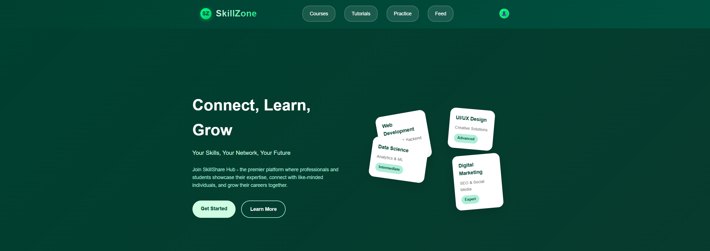

# 🚀 SkillZone - Django Project

SkillZone is a Django-based web application built with Django 5.2.4 for learning, skill-sharing, or community interaction.

---


## 🖼️ Project Preview

  
  


## 📦 Features

- User authentication system
- Custom user model
- Post and feed system
- Media upload support
- Clean Django project structure

---

## 🛠️ Project Setup

Follow the steps below to set up the project on your local machine.

### 1. Clone the repository

```bash
git clone https://github.com/your-username/SkillZone.git
cd SkillZone
```

2. Create and activate a virtual environment
```bash
python -m venv venv

source venv/bin/activate   # On Windows: venv\Scripts\activate
```
3. Install dependencies
 ```bash
pip install -r requirements.txt
```

Step 1: Create a .env file
##🔧 Environment Variables
```bash
cp .env.example .env
```

Step 2: Generate a secret key
Open Python shell:
 ```bash
python
#then:
SECRET_KEY=your-generated-secret-key
DEBUG=True
```
⚠️ Error Tip:
If you get an error like:
```bash
decouple.UndefinedValueError: SECRET_KEY not found
```
It means you forgot to create or fill in the .env file.

▶️ Run the Server(Before that makemigrations and migrate)
```bash
python manage.py migrate
python manage.py runserver
```


